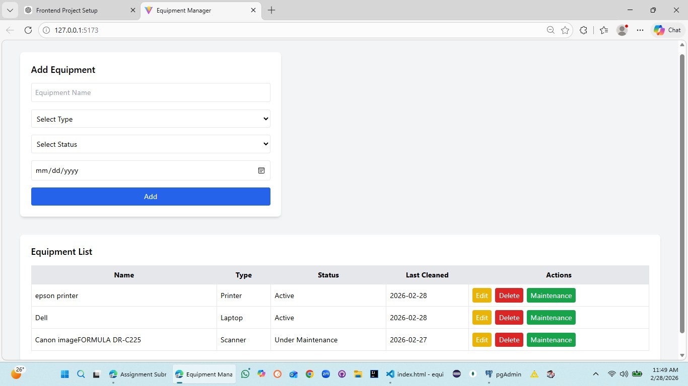

# Equipment Management System

A Full Stack Equipment Management System built using:

- React (Vite) – Frontend
- Spring Boot – Backend
- PostgreSQL – Database

This application allows users to add, view, and manage equipment records.

---

## 📌 Project Structure

equipment-management-system/
│
├── frontend/        → React (Vite)
├── equipment/       → Spring Boot Backend
├── screenshots/
└── README.md

---

## ⚙️ Prerequisites

Make sure the following are installed:

- Node.js (v16.20.2)
- Java 17
- Maven
- PostgreSQL
- pgAdmin (optional, for DB GUI)

---

# 🗄️ Database Setup (PostgreSQL)

## Step 1: Open pgAdmin

Login using your PostgreSQL credentials.

## Step 2: Create Database

Right-click on Databases → Create → Database

Database name:

equipment_db

Click Save.

---

## Step 3: Configure Backend Database Connection

Open:

equipment/src/main/resources/application.properties

Update:

spring.datasource.url=jdbc:postgresql://localhost:5432/equipment_db
spring.datasource.username=postgres
spring.datasource.password=YOUR_PASSWORD

spring.jpa.hibernate.ddl-auto=update
spring.jpa.show-sql=true
spring.jpa.open-in-view=false
server.port=8080

Replace YOUR_PASSWORD with your PostgreSQL password.

---

# 🚀 Backend Setup (Spring Boot)

## Step 1: Navigate to backend folder

cd equipment

## Step 2: Run the backend

mvn spring-boot:run

If successful, you will see:

Tomcat started on port 8080

Backend runs on:
http://localhost:8080

---

# 💻 Frontend Setup (React + Vite)

## Step 1: Navigate to frontend folder

cd frontend

## Step 2: Install dependencies

npm install

## Step 3: Start frontend

npm run dev

Frontend runs on:
http://localhost:5173

---

# 🔗 Connecting Frontend & Backend

The frontend makes API calls to:

http://localhost:8080/api/equipment

CORS is enabled in backend using:

@CrossOrigin(origins = "http://localhost:5173")

---

# 📦 Additional Libraries Used

## Frontend

- React
- Vite
- Axios (if used)
- Bootstrap (if used)

Install frontend dependencies:

npm install

---

## Backend

- Spring Web
- Spring Data JPA
- PostgreSQL Driver
- Lombok

Dependencies are managed using Maven.

---

# 🧪 API Endpoints

Base URL:
http://localhost:8080/api/equipment

Available APIs:

GET     /api/equipment        → Get all equipment
POST    /api/equipment        → Add new equipment
PUT     /api/equipment/{id}   → Update equipment
DELETE  /api/equipment/{id}   → Delete equipment

---

# 📸 Project Screenshot

---

# 📝 Assumptions Made

- Application runs locally (localhost only)
- No authentication/authorization implemented
- Single user system
- Equipment status stored as simple string
- No advanced validation implemented
- PostgreSQL running on default port 5432

---

# 🎯 Future Improvements

- Add user authentication (JWT)
- Role-based access (Admin/User)
- Deployment on cloud (Render/Netlify)
- Add search & filter functionality
- Add pagination

---

# 👩‍💻 Author

Lekha  
Full Stack Developer (React + Spring Boot + PostgreSQL)
